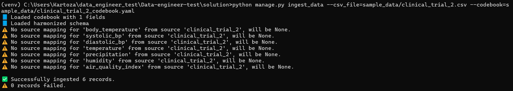
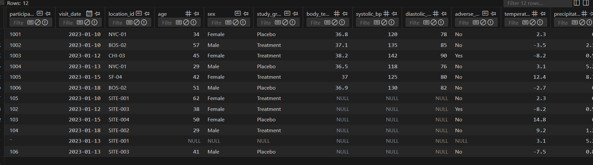
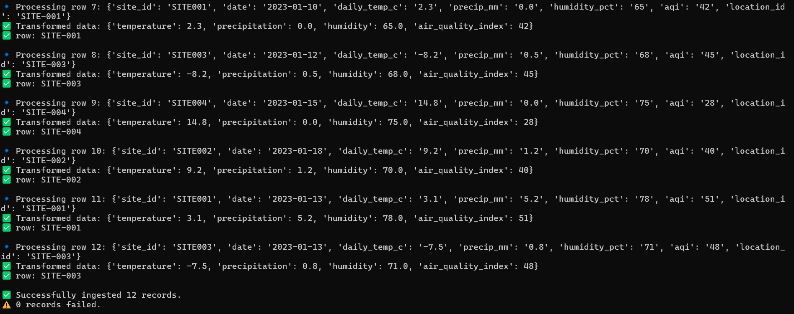

# 🧬 Solution

A Django-based data harmonisation tool to ingest clinical and environmental datasets with varying schemas, map them to a unified format, and store them in a PostgreSQL-backed model.


## 🏗️ Setup Instructions

### 1. Clone the repository

```bash
git clone https://github.com/tinashechiraya/Data-engineer-test.git
cd <repo-directory>
```

### 2. Create a virtual environment

```bash
python -m venv venv
source venv/bin/activate  # On Windows: venv\Scripts\activate
```

> **Note**: be sure to have python installed on system running project

### 3. Install dependencies

```bash
pip install -r requirements.txt
```

> **Note**: Rename `test.env` to `.env` and ensure PostgreSQL is running with credentials set correctly. If the `USE_POSTGRES` variable is set to `False`, the system will default to using a SQLite database.


### 4. Navigate to project folder

```bash
cd solution
```

### 4. Apply database migrations

```bash
python manage.py migrate
```

## 🛠️ Usage

Run the ingestion command:

```bash
python manage.py ingest_data --csv_file=<relative_path_to_csv> --codebook=<relative_path_to_codebook>
```

### ✅ Example:

```bash
python manage.py ingest_data --csv_file=sample_data/climate_daily.csv --codebook=sample_data/climate_codebook.yaml
```

> **Note**: After this command results will be logged on the console.

## 🧩 Approach used

### 🔍 Ingestion Logic:

* Loads CSV and YAML codebook.
* Loads the unified schema from `harmonized_clinical_schema.yaml`.
* Infers source dataset using CSV column names.
* Maps source fields to harmonised fields based on schema and source mappings.
* Applies transformation rules (e.g., `M` → `Male`).
* Performs type conversions (e.g., date strings → `DateField`).
* Joins/merges datasets based on `location_id` and `visit_date`.
* Handles missing fields gracefully and logs errors with summaries.

### 🧱 Harmonized Model:

All harmonized fields defined in the schema are stored in a single `HarmonizedRecord` Django model, using appropriate Django field types (`CharField`, `IntegerField`, `DateField`, etc.).

### 🔄 Duplicate Handling:

Records are inserted or updated using:

```python
HarmonizedRecord.objects.update_or_create(
    location_id=..., visit_date=..., defaults=...
)
```

Allowing the clinical and environmental data to be merged.

## 📌 Assumptions

* Dates follow `YYYY-MM-DD` format.
* Harmonization depends on accurate `location_id` and `visit_date`.
* `source_name` is inferred by intersecting schema mappings with CSV columns.
* If mapping or data type conversion fails, the row is skipped with a warning.

---

## ✅ Output Summary

After execution, the command prints:

* Number of successfully ingested records
* Number of failed records
* Any issues with schema inference or transformations

---

## 🔐 Example Output

```
📘 Loaded codebook
📘 Loaded harmonized schema
🧩 Field mappings: { ... }
✅ Successfully ingested 57 records.
⚠️ 3 records failed.
```




## 🔐 Examples



